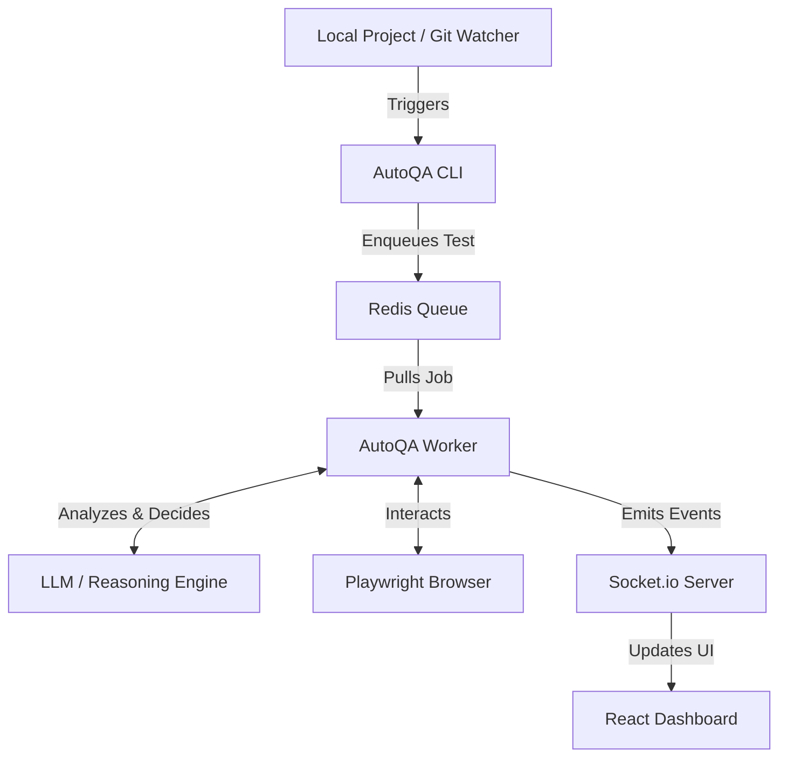

# AutoQA: You build it. We test it.

## Why do we need this?
We've all been there: you finish a shiny new feature or make a minor update, only to realize you now have to painstakingly click through the app to make sure you didn't break anything else. Repeating manual tests after every single change is tedious and soul-crushing.

**The solution?** AutoQA completely removes the burden of manual QA. It acts as an autonomous testing agent that watches your repository, discovers what you're working on, and automatically generates and executes end-to-end tests for your application in real-time.

## What it is

### Key Features
- **Zero-Touch Testing**: Just write code. AutoQA watches your git commits and automatically tests new features.
- **AI-Powered Reasoning**: Uses Large Language Models (Gemini) to understand natural language instructions and application states.
- **Headless Browser Automation**: Executes real browser interactions using Playwright.
- **Real-Time Dashboard**: Watch your tests execute step-by-step in a sleek web interface.
- **Background Job Queue**: Asynchronous processing using Redis and BullMQ so your local dev flow isn't blocked.

### Architecture


### Execution Workflow
1. **Trigger**: You commit a change or manually issue a test command via the CLI.
2. **Queue**: The test instruction is formatted and pushed into a Redis-backed queue.
3. **Reasoning**: The worker picks up the job and uses an LLM to analyze the page state and decide the next best action.
4. **Execution**: The chosen action (click, type, navigate) is performed on a headless browser.
5. **Report**: Results, logs, and screenshots are broadcasted to the dashboard and saved to the database.

## Get it running

### Prerequisites
Before starting, ensure you have a Redis server running. AutoQA uses it for its background job queue.

```bash
# Start a lightweight Redis server in memory (can be run from anywhere)
npx redis-memory-server
```

### Quick Start
Follow these steps to initialize AutoQA in any target project (like `Eventra`).

**1. Initialization (Run once per target project)**
Initialize AutoQA in your target project. This creates an `autoqa.config.json` in that directory and provisions the global SQLite database.
```bash
# MUST be run from inside your TARGET project directory (e.g., cd ~/Documents/Eventra)
npx tsx /home/samash/Documents/Localdev/autoqa/packages/cli/bin/autoqa.ts init
```

**2. Start Background Services**
You must leave these running in separate terminals. They listen for queue jobs and broadcast updates.
```bash
# MUST be run from inside your TARGET project directory
# Terminal 1 (Queue Worker):
npx tsx /home/samash/Documents/Localdev/autoqa/packages/cli/bin/autoqa.ts worker

# Terminal 2 (Dashboard Backend):
npx tsx /home/samash/Documents/Localdev/autoqa/packages/cli/bin/autoqa.ts dashboard-server
```

*(Optional)* If you want to view the React UI dashboard to see test progress:
```bash
# MUST be run from the AutoQA directory
cd /home/samash/Documents/Localdev/autoqa
npm run dev --workspace=packages/dashboard
```

**3. Triggering Tests**
You can manually trigger tests or watch your project for file changes to automatically generate them.
```bash
# MUST be run from inside your TARGET project directory

# Run a specific manual AI test:
npx tsx /home/samash/Documents/Localdev/autoqa/packages/cli/bin/autoqa.ts test "Verify that the homepage loads"

# Run a deterministic smoke test (skips the LLM entirely):
npx tsx /home/samash/Documents/Localdev/autoqa/packages/cli/bin/autoqa.ts smoke

# Watch your target code for changes and auto-trigger tests based on git commits:
npx tsx /home/samash/Documents/Localdev/autoqa/packages/cli/bin/autoqa.ts watch
```

## Configuration Reference

The `autoqa.config.json` file is created in your project root after running `init`.

| Field | Description | Default |
|-------|-------------|---------|
| `targetUrl` | The local development server URL your app runs on. | `http://localhost:3000` |
| `ignoredPaths` | Comma-separated paths the git watcher should ignore. | `["node_modules", "dist", "build", "coverage"]` |
| `geminiApiKey` | Your Google Gemini API Key for the LLM reasoning engine. | *Reads from `process.env.GEMINI_API_KEY`* |
| `databaseUrl` | Location of the global SQLite database used by AutoQA. | `file:~/.autoqa/dev.db` |
| `testUserCredentials` | Credentials for test accounts to handle authentication flows. | *(Optional/Not set by default)* |

## CLI Reference

| Command | Options | Description |
|---------|---------|-------------|
| `init` | None | Initializes AutoQA config (`autoqa.config.json`) and database in the current project. |
| `test <instruction>` | `--url <url>` | Runs a single AI-driven test against the local dev server. |
| `smoke` | `--url <url>` | Runs a deterministic smoke test, bypassing the LLM. |
| `watch` | `--url <url>` | Watches the git repository for new commits to autonomously enqueue tests. |
| `worker` | None | Starts the BullMQ worker to process queued tests in the background. |
| `dashboard-server`| None | Starts the real-time Socket.IO backend for the dashboard UI. |
| `review` | None | Reviews discovered features and prompts you to auto-generate tests (Legacy). |

## Trust and Honesty

### Project Status & Limitations
We believe in being completely transparent about what AutoQA can and cannot do right now:
- **What Works**: Basic navigation, standard interactions (clicking buttons, filling forms), queue management, and real-time dashboard reporting are fully functional. Smoke tests run flawlessly.
- **What's Flaky**: LLM reasoning can occasionally hallucinate DOM elements or get stuck in loops if the UI changes unexpectedly in complex ways. Complex drag-and-drop or canvas interactions are currently unstable.
- **What Doesn't Yet**: Seamless handling of CAPTCHAs, multi-factor authentication flows, and highly dynamic WebGL applications.

### Troubleshooting & FAQ

**Q: AutoQA crashes immediately on startup / Worker fails.**
**A:** Is your Redis server running? AutoQA requires Redis for the BullMQ queue. Run `npx redis-memory-server` in a separate terminal.

**Q: Playwright errors saying "Browser not installed".**
**A:** You need to install the browser binaries for Playwright. Run `npx playwright install` in your terminal.

**Q: "Target URL unreachable" error.**
**A:** Ensure your target application's local development server (e.g., `npm run dev`) is actually running on the port specified in `targetUrl` (default is 3000).

**Q: MCP Connection Issues / LLM isn't responding.**
**A:** Double-check that your `geminiApiKey` is correctly set in `autoqa.config.json` or as an environment variable. If the MCP connection fails, verify your internet connection or check if the API provider is experiencing downtime.
