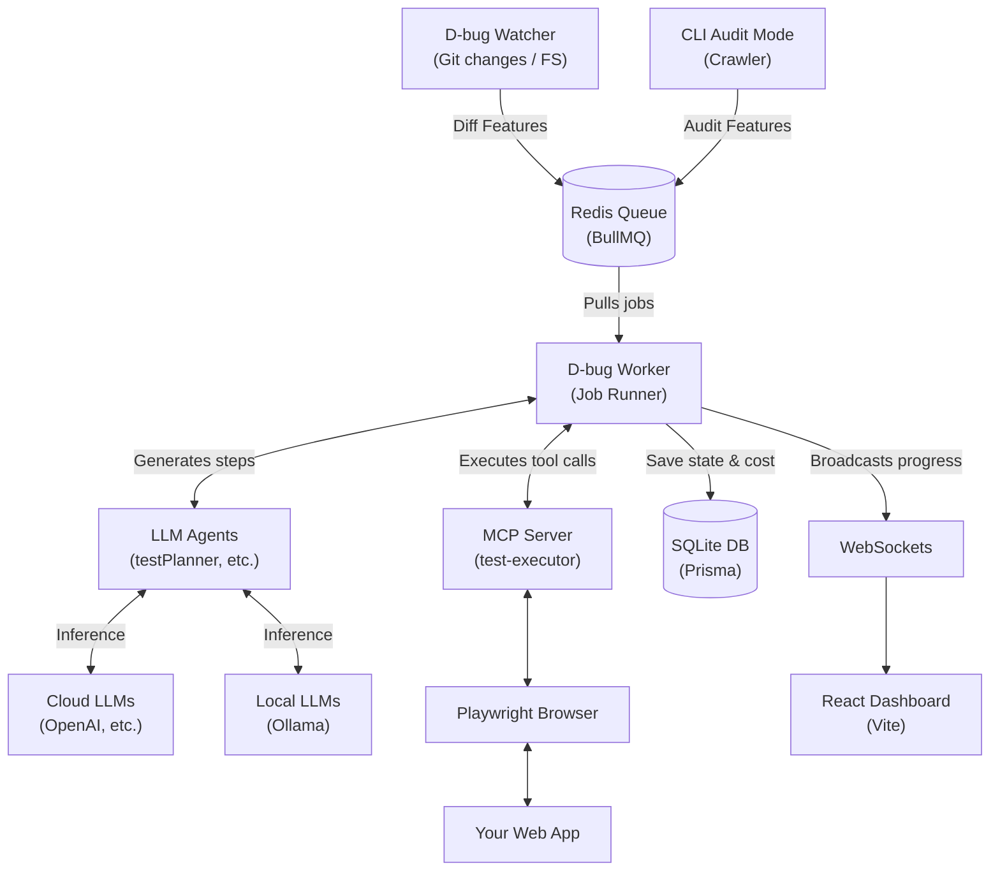

# D-bug 🐛

An autonomous, local-first, AI-driven end-to-end testing agent that discovers, classifies, and tests your web applications without requiring you to write a single line of test code.

### 🎯 The Problem it Solves

Traditional E2E UI testing is a massive bottleneck. Writing Playwright or Cypress scripts is time-consuming, and they are notoriously brittle—breaking the moment a developer changes a CSS class or DOM structure. Furthermore, existing "AI QA" platforms force you to route your proprietary code and API traffic through their expensive, closed-ecosystem cloud servers.

D-bug solves this by using dynamic LLM agents to visually and structurally understand your app in real-time, executing tests resiliently via the Model Context Protocol (MCP). It does this while keeping you entirely in control of your data, models, and costs.

<!-- TODO: add a short GIF of the dashboard mid-run -->

### ✨ Key Features

- **Multi-provider BYOK (Bring Your Own Key):** Agnostic LLM support. Plug in OpenAI, Anthropic, Gemini, or run entirely offline with local open-source models via Ollama/LM Studio.
- **Smart Fallback Escalation:** Configure D-bug to attempt tests using free, local models first, automatically escalating to smarter cloud models (like GPT-4o) only if the local model gets stuck or fails a structured output parse.
- **Autonomous Discovery (Audit Mode):** A built-in crawler that navigates your app, simulates accessibility snapshots, intercepts network requests, and uses AI to map out every interactive feature automatically.
- **Intelligent Test Generation:** Generates bespoke testing strategies based on feature types (e.g., asserting CSS bounding-box changes for animations, or injecting safe fixture data for forms).
- **Cost & Token Tracking:** Granular tracking of every token burned, calculating exact USD costs per run, complete with budget ceilings to prevent runaway AI loops.

### 🏗 Architecture



### 🔄 Workflow

1. **Trigger:** Save a file (triggering the Git watcher) OR run `d-bug audit`.
2. **Analysis:** The `diffAnalyzer` or `featureClassifier` LLM identifies interactive features and queues them in Redis.
3. **Agentic Execution:** The BullMQ worker boots a headless Chromium browser wrapped in an MCP server.
4. **Autonomous Loop:** The `testPlanner` AI interacts via MCP (click/fill), observes results, and loops until it proves the feature works.
5. **Real-time Dashboard:** Screenshots and exact token costs stream via Socket.IO to your local React dashboard.

### 📋 Prerequisites

- **Node.js**: v18 or higher (v26+ supported).
- **Redis**: Must be running locally (e.g., `docker run -d -p 6379:6379 redis`) for the BullMQ job queue.
- **Playwright**: Browsers must be installed via `npx playwright install`.
- **LLM Provider**: An API key (OpenAI/Anthropic/Gemini) OR a running local instance like Ollama.

### 🚀 Quickstart

1. **Clone and Install:**
```bash
git clone <repo-url> d-bug
cd d-bug
npm install
npm run build
npx playwright install
```

2. **Link the CLI globally (Optional but recommended):**
```bash
npm link --workspace=@autoqa/cli
```

3. **Initialize in your target project:**
```bash
cd /path/to/your/app
d-bug init
```

4. **Start the magic:**
```bash
# In the d-bug monorepo root:
npm run start:all
```
*(This launches the wizard to boot the Watcher, Worker, Dashboard UI, and Dashboard Server concurrently).*

### 💻 CLI Reference

*(Note: The binary name is `d-bug`, but the package is internally referred to as `@autoqa/cli` for historical reasons).*

| Command | Description |
|---|---|
| `d-bug init` | Interactive wizard to set up your LLM providers, API keys, and environment variables. |
| `d-bug watch` | Starts the daemon that monitors your git repository for saved changes. |
| `d-bug worker` | Starts the BullMQ worker to process queued tests autonomously. |
| `d-bug dashboard-server` | Boots the WebSocket server for the UI dashboard. |
| `d-bug audit [--force] [--url <url>]` | Crawls the current project, discovers all features, and sequentially tests them against your configured budget. |
| `d-bug test <instruction>` | Manually forces the agent to execute a specific natural-language test instruction in the browser. |
| `d-bug review` | Interactive CLI review of discovered features to selectively trigger tests. |
| `d-bug smoke` | Run a deterministic smoke test skipping the LLM entirely. |

### ⚙ Config Reference (`d-bug.config.json`)

When you run `d-bug init`, it creates a `d-bug.config.json` file in your root:

| Key | Type | Default | Purpose |
|---|---|---|---|
| `targetUrl` | `string` | `"http://localhost:5173"` | The local dev server URL D-bug will test against. |
| `ignoredPaths` | `string[]` | `["node_modules", "dist", "build", "coverage"]` | Directories the Git watcher will ignore. |
| `databaseUrl` | `string` | `"file:/home/<user>/.autoqa/dev.db"` | Path to the local SQLite database. |
| `llm.<agentType>` | `object \| array` | *(Depends on init)* | Configuration for `testPlanner`, `featureClassifier`, `diffAnalyzer`, and `resultAnalyzer`. Pass an array of objects to enable Fallback Escalation (e.g. Local -> Cloud). |
| `llm.<agentType>[].provider` | `string` | `"openai"` | `"openai"`, `"anthropic"`, `"gemini"`, or `"local"`. |
| `llm.<agentType>[].model` | `string` | `"gpt-4o"` | The model ID (e.g., `"llama3.1"`). |
| `llm.<agentType>[].apiKey` | `string` | `""` | Can use `env:VAR_NAME` to load securely from env. |
| `llm.<agentType>[].baseUrl` | `string` | `""` | Custom endpoint (e.g., `"http://localhost:11434/v1"` for Ollama). |
| `audit.avoidText` | `string[]` | `["delete", "cancel subscription", ...]` | Strings that trigger a hard-abort if found on a button. |
| `audit.neverSubmitForms` | `string[]` | `["payment", "checkout"]` | Form actions/IDs that the AI is forbidden from submitting. |
| `audit.maxPages` | `number` | `10` | Maximum pages the Audit crawler will index via BFS. |
| `audit.maxElementsPerPage`| `number`| `15` | Maximum interactive elements audited per page. |
| `audit.maxAuditDurationMinutes`|`number`| `30` | Time ceiling for a single audit run. |
| `audit.maxCostUsd` | `number` | `2.00` | Hard USD cost ceiling for API tokens across a single audit. |

### 🚧 Project Status & Limitations

- **Audit Mode Maturity:** Highly functional but experimental. It relies heavily on Playwright coordinate bounding boxes and AI visual reasoning, which can occasionally misclick on highly complex SPAs or layered modals.
- **Local Model Reliability:** While `llama3.1` (via Ollama) is supported, local models occasionally struggle with perfectly conforming to the strict JSON schemas required by the test planner. **Fallback Escalation is highly recommended** to seamlessly catch and recover from parsing failures.
- **Framework Support:** Works generically across any framework via Playwright, but has been battle-tested most extensively against React/Vite SPAs.

### 🚑 Troubleshooting / FAQ

- **Worker hangs or throws `ECONNREFUSED`:** Your Redis instance isn't running. Start it with `docker run -d -p 6379:6379 redis`.
- **Playwright fails to launch Chromium:** You are missing the browser binaries. Run `npx playwright install`.
- **"Provider <name> failed compatibility check":** The pre-flight Canary Check failed. Ensure your API key is correctly exported in your `.env` or that your local Ollama server is actually running and `baseUrl` is correct.
- **"fetch failed" / Target URL unreachable:** Ensure your actual application's dev server (e.g., Vite/Next.js) is actively running on the exact `targetUrl` specified in your config.

### 📁 Project Structure

D-bug is a modular monorepo:

| Package | Role | Description |
|---|---|---|
| `packages/llm-agents` | **The Brain** | Houses the LLM provider adapters, fallback orchestration, and the distinct Agent prompts. |
| `packages/test-executor` | **The Hands** | An MCP Server that exposes Playwright browser actions as callable tools for the LLM. |
| `packages/cli` | **Nervous System** | The Git Watcher, BullMQ worker daemon, and CLI orchestrator. |
| `packages/db` | **The Memory** | Prisma schema and SQLite database. |
| `packages/dashboard` | **The Face** | A Vite + React frontend for visualizing real-time test executions. |

### 🛠️ Local Development Setup

To build and run the monorepo from scratch:

```bash
# 1. Install dependencies across workspaces
npm install

# 2. Build TypeScript
npm run build

# 3. Sync Database Schema
npx prisma db push --schema=packages/db/prisma/schema.prisma

# 4. Link CLI globally
npm link --workspace=@autoqa/cli

# 5. Start stack
npm run start:all
```

### 🗺 Roadmap & Contributing
*(No formal `CONTRIBUTING.md` exists yet. Feel free to open an issue or PR with suggestions!)*

---
*Built with ❤️ to make E2E testing painless.*
